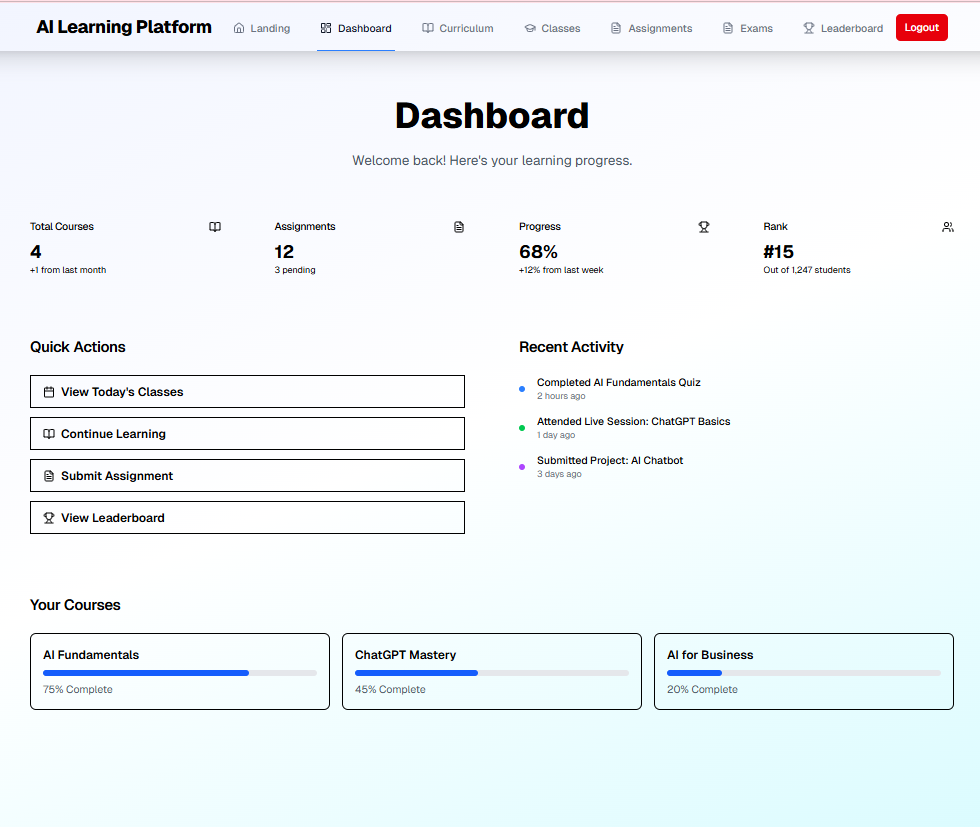
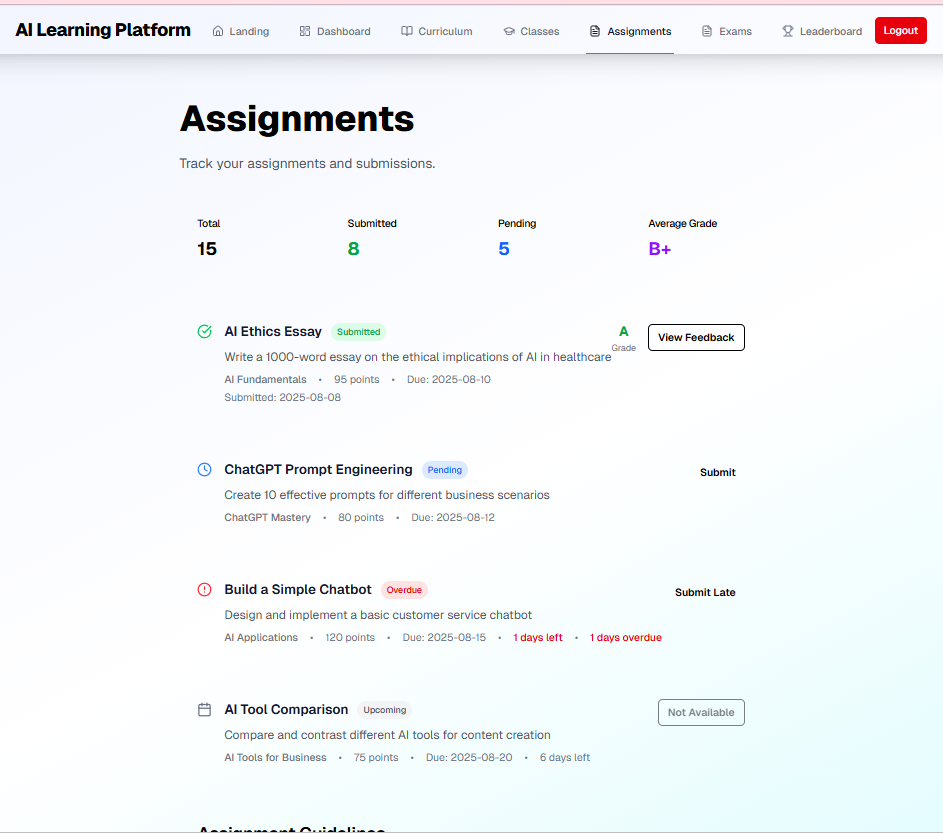
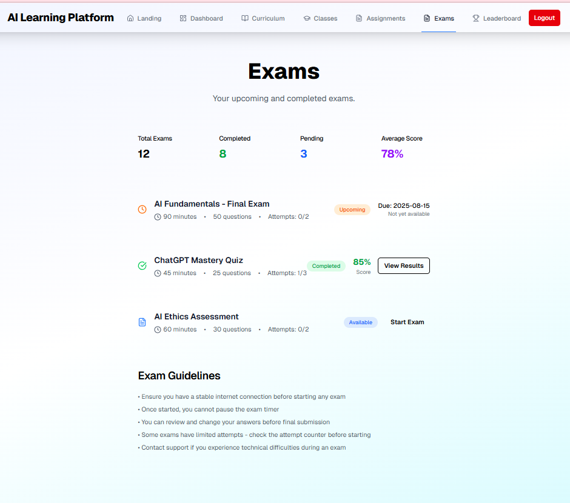
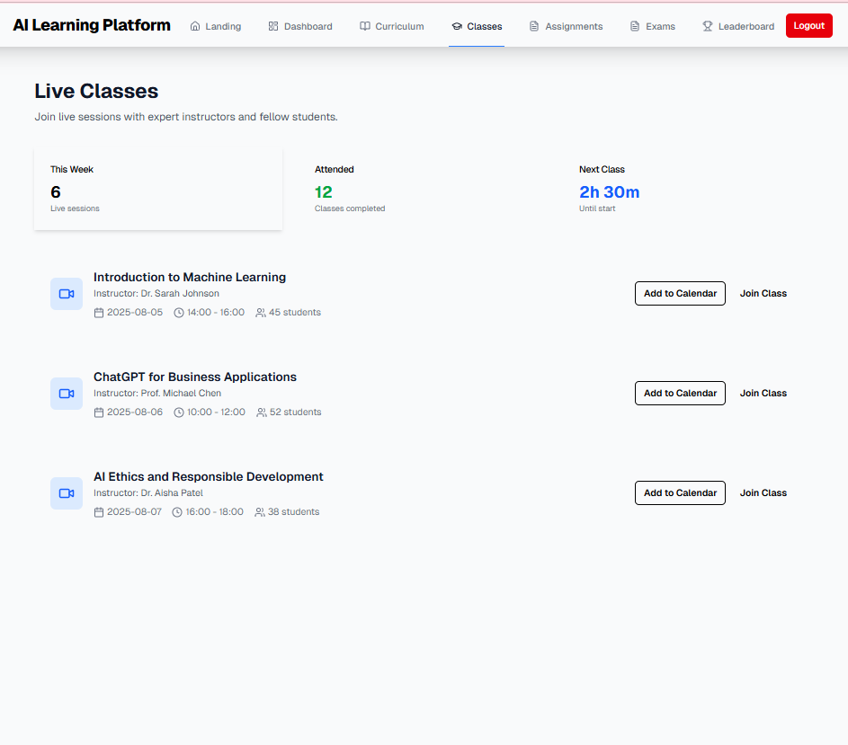
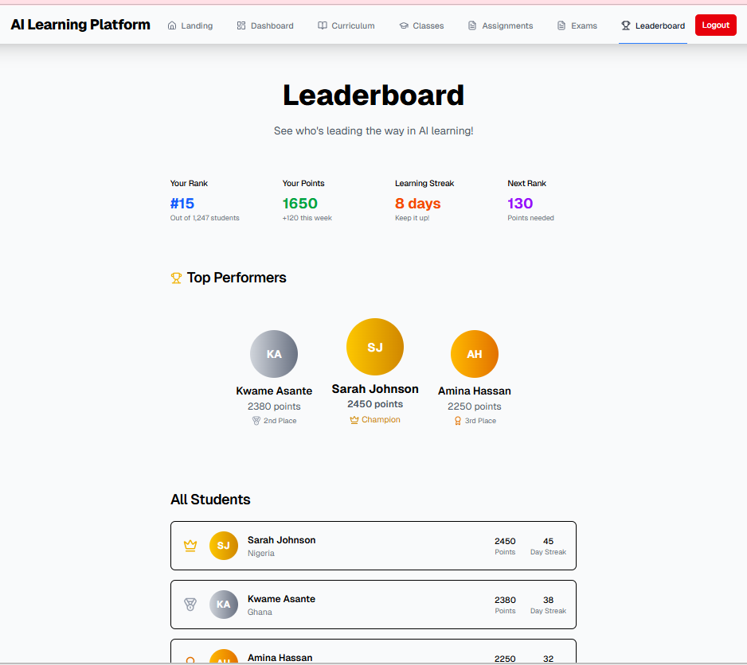
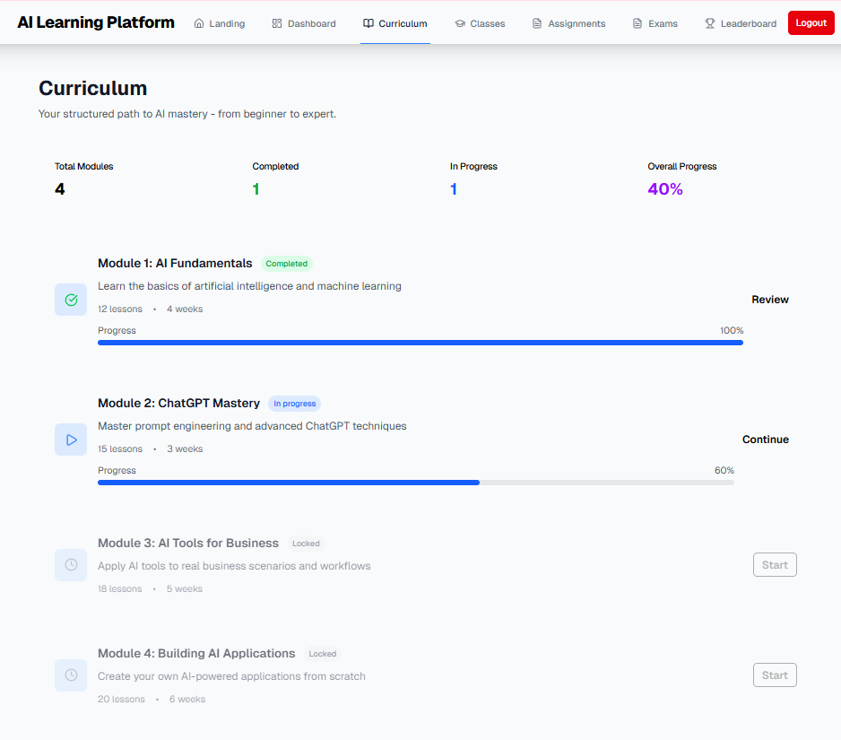

# AI Learning Platform

## Overview

A modern, scalable React/Next.js platform for AI education, featuring:

- Beautiful, responsive UI (2025 CSS trends)
- Modular architecture with reusable components
- Comprehensive test coverage
- Ready for web and mobile expansion

## Features

- Dashboard, Curriculum, Assignments, Exams, Leaderboard
- Glassmorphism cards, accent gradients, animated buttons
- Role-based navigation and access
- Unit and integration tests (Jest, React Testing Library)
- ESLint, Prettier, TypeScript

## Demo

Live Link: https://ai-learning-platform-olive.vercel.app/

## Screenshots

<table>
  <tr>
    <td align="center">
      
      <br />
      <sub>Landing Page</sub>
    </td>
    <td align="center">
      
      <br />
      <sub>Dashboard</sub>
    </td>
  </tr>
  <tr>
    <td align="center">
      
      <br />
      <sub>Assignments</sub>
    </td>
    <td align="center">
      
      <br />
      <sub>Exams</sub>
    </td>
  </tr>
  <tr>
    <td align="center">
      
      <br />
      <sub>Classes</sub>
    </td>
    <td align="center">
      
      <br />
      <sub>Leaderboard</sub>
    </td>
  </tr>
  <tr>
    <td colspan="2" align="center">
      
      <br />
      <sub>Curriculum</sub>
    </td>
  </tr>
  
</table>

## Technologies

- React 19, Next.js 15, TypeScript
- Tailwind CSS
- Jest, React Testing Library
- Lucide Icons

## Getting Started

1. **Install dependencies:**

```bash
npm install
```

2. **Run the app:**

```bash
npm run dev
```

3. **Environment variables (Firebase):**

- Copy the example file and add your Firebase Web App config values:

```
# Windows (PowerShell)
Copy-Item .env.local.example .env.local
```

Paste values from Firebase into `.env.local`:

```
NEXT_PUBLIC_FIREBASE_API_KEY=...
NEXT_PUBLIC_FIREBASE_AUTH_DOMAIN=...
NEXT_PUBLIC_FIREBASE_PROJECT_ID=...
NEXT_PUBLIC_FIREBASE_STORAGE_BUCKET=...
NEXT_PUBLIC_FIREBASE_MESSAGING_SENDER_ID=...
NEXT_PUBLIC_FIREBASE_APP_ID=...
NEXT_PUBLIC_FIREBASE_MEASUREMENT_ID=...
```

Notes:

- `.env.local` is ignored by git.
- Restart the dev server after changes.

4. **Run tests:**

```bash
npm run test
```

## Project Structure

```
src/
  app/           # Main pages
  components/    # Reusable UI components
  __tests__/     # Unit and integration tests
  lib/           # Utilities
public/          # Static assets
```

## Coding Standards & Best Practices

- Use functional components and hooks
- Type all props and state
- Keep components small and focused
- Use Context API for shared state
- Write tests for all components and pages
- Use semantic HTML and ensure accessibility
- Commit with clear messages and use feature branches

## Deployment

- Build: `npm run build`
- Start: `npm run start`
- Deploy to Vercel, Netlify, or your preferred platform

## Contribution Guidelines

- Fork and clone the repo
- Create a feature branch
- Write tests for new features
- Submit a pull request with a clear description

## License

MIT

# AI Learning Platform

This is a modern, mobile-responsive AI learning platform built with [Next.js](https://nextjs.org). It offers a hands-on, beginner-friendly AI course for learners in Ghana and Nigeria, featuring live classes, assignments, exams, and a leaderboard.

Live Preview: https://ai-learning-platform-olive.vercel.app/

## Features

- **Mobile Responsive:** Fully optimized for all device sizes
- **Leaderboard:** Track your rank and progress among fellow learners
- **Live Classes:** Join interactive sessions with expert instructors
- **Assignments & Exams:** Submit work, view grades, and track deadlines
- **Curriculum:** Structured modules from AI basics to building apps
- **Dashboard:** Monitor your learning stats and quick actions
- **Student Testimonials:** Real feedback from past learners
- **Scholarships & Enrollment:** Apply for financial aid or enroll directly

## Tech Stack

- [Next.js](https://nextjs.org) (App Router)
- [React](https://react.dev)
- [Tailwind CSS](https://tailwindcss.com) for styling
- [Radix UI](https://www.radix-ui.com/) for accessible components
- [Lucide React](https://lucide.dev/) for icons
- [TypeScript](https://www.typescriptlang.org/) for type safety

## Mobile Responsiveness

All pages and components are designed to be fully mobile responsive:

- Navigation adapts to mobile with a hamburger menu
- Cards, tables, and grids stack and scale for small screens
- Touch targets and font sizes optimized for accessibility
- Viewport configuration follows Next.js best practices

## Getting Started

First, run the development server:

```bash
npm run dev
# or
yarn dev
# or
pnpm dev
# or
bun dev
```

Open [http://localhost:3000](http://localhost:3000) with your browser to see the result.

You can start editing the page by modifying `app/page.tsx`. The page auto-updates as you edit the file.

This project uses [`next/font`](https://nextjs.org/docs/app/building-your-application/optimizing/fonts) to automatically optimize and load [Geist](https://vercel.com/font), a new font family for Vercel.

## Project Structure

```
eslint.config.mjs
next-env.d.ts
next.config.ts
package.json
postcss.config.mjs
README.md
tsconfig.json
public/
  ...assets...
src/
  app/
    ...pages...
  components/
    ...UI components...
  lib/
    ...utilities...
```

## Learn More

To learn more about Next.js, take a look at the following resources:

- [Next.js Documentation](https://nextjs.org/docs) - learn about Next.js features and API.
- [Learn Next.js](https://nextjs.org/learn) - an interactive Next.js tutorial.

You can check out [the Next.js GitHub repository](https://github.com/vercel/next.js) - your feedback and contributions are welcome!

## Deploy on Vercel

The easiest way to deploy your Next.js app is to use the [Vercel Platform](https://vercel.com/new?utm_medium=default-template&filter=next.js&utm_source=create-next-app&utm_campaign=create-next-app-readme) from the creators of Next.js.

Check out our [Next.js deployment documentation](https://nextjs.org/docs/app/building-your-application/deploying) for more details.
