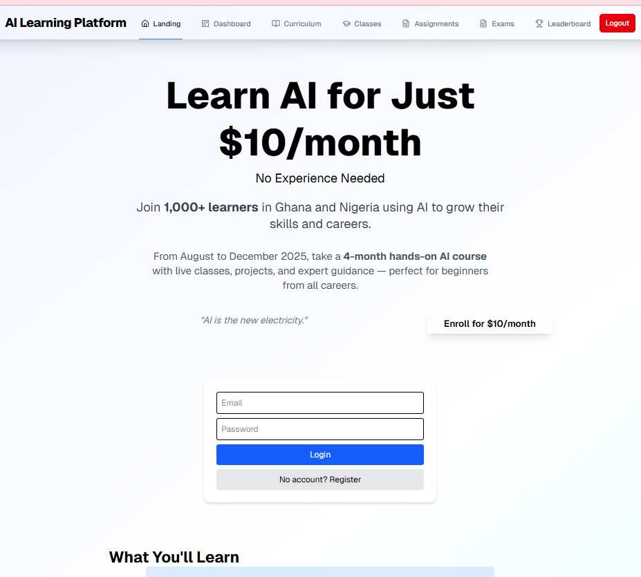

# AI Learning Platform

## Overview

A modern, scalable React/Next.js platform for AI education, featuring:

- Beautiful, responsive UI (2025 CSS trends)
- Modular architecture with reusable components
- Comprehensive test coverage
- Ready for web and mobile expansion

## Features

- Dashboard, Curriculum, Assignments, Exams, Leaderboard
- Glassmorphism cards, accent gradients, animated buttons
- Role-based navigation and access
- Unit and integration tests (Jest, React Testing Library)
- ESLint, Prettier, TypeScript

## Demo

Live Link: https://ai-learning-platform-olive.vercel.app/

## Screenshots

<table>
  <tr>
    <td align="center">
      
      <br />
      <sub>Landing Page</sub>
    </td>
    <td align="center">
      
      <br />
      <sub>Dashboard</sub>
    </td>
  </tr>
  <tr>
    <td align="center">
      
      <br />
      <sub>Assignments</sub>
    </td>
    <td align="center">
      
      <br />
      <sub>Exams</sub>
    </td>
  </tr>
  <tr>
    <td align="center">
      
      <br />
      <sub>Classes</sub>
    </td>
    <td align="center">
      
      <br />
      <sub>Leaderboard</sub>
    </td>
  </tr>
  <tr>
    <td colspan="2" align="center">
      
      <br />
      <sub>Curriculum</sub>
    </td>
  </tr>
  
</table>

## Technologies

- React 19, Next.js 15, TypeScript
- Tailwind CSS
- Jest, React Testing Library
- Lucide Icons

## Getting Started

1. **Install dependencies:**

```bash
npm install
```

2. **Run the app:**

```bash
npm run dev
```

3. **Environment variables (Firebase):**

- Copy the example file and add your Firebase Web App config values:

```
# Windows (PowerShell)
Copy-Item .env.local.example .env.local
```

Paste values from Firebase into `.env.local`:

```
NEXT_PUBLIC_FIREBASE_API_KEY=...
NEXT_PUBLIC_FIREBASE_AUTH_DOMAIN=...
NEXT_PUBLIC_FIREBASE_PROJECT_ID=...
NEXT_PUBLIC_FIREBASE_STORAGE_BUCKET=...
NEXT_PUBLIC_FIREBASE_MESSAGING_SENDER_ID=...
NEXT_PUBLIC_FIREBASE_APP_ID=...
NEXT_PUBLIC_FIREBASE_MEASUREMENT_ID=...
```

Notes:

- `.env.local` is ignored by git.
- Restart the dev server after changes.

4. **Run tests:**

```bash
npm run test
```

## Project Structure

```
src/
  app/           # Main pages
  components/    # Reusable UI components
  __tests__/     # Unit and integration tests
  lib/           # Utilities
public/          # Static assets
```

## Coding Standards & Best Practices

- Use functional components and hooks
- Type all props and state
- Keep components small and focused
- Use Context API for shared state
- Write tests for all components and pages
- Use semantic HTML and ensure accessibility
- Commit with clear messages and use feature branches

## Deployment

- Build: `npm run build`
- Start: `npm run start`
- Deploy to Vercel, Netlify, or your preferred platform

## Contribution Guidelines

- Fork and clone the repo
- Create a feature branch
- Write tests for new features
- Submit a pull request with a clear description

## License

MIT